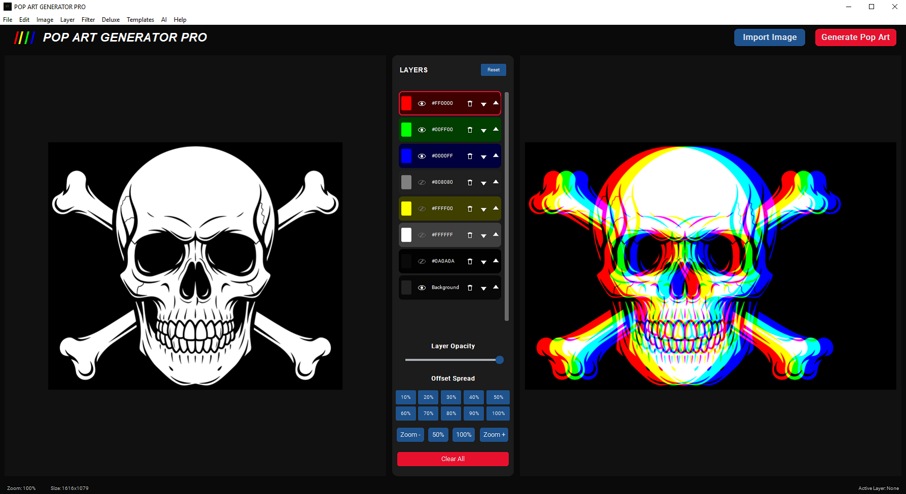
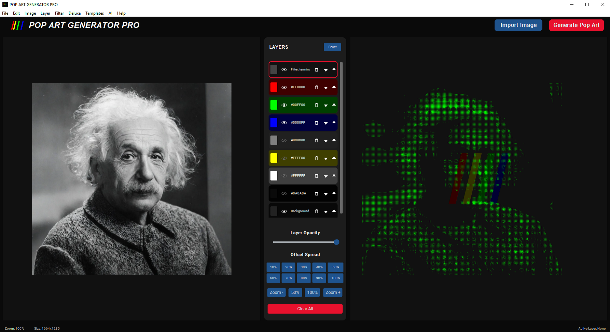

<p align="center">
  
</p>

<p align="center">
  
</p>

<h1 align="center">POP ART GENERATOR PRO</h1>

<p align="center">
  A commercial-grade, fully offline pop-art creation tool.
</p>

<p align="center">
  Transform images into vibrant silkscreen art and multi-exposure layers using local AI processing.
  <br>
  No cloud services. No APIs. No subscriptions.
</p>

---

# POP ART GENERATOR PRO

A professional offline pop-art studio.

Upload an image, remove the background locally, and forge it into clean, vibrant silkscreen layers or ready-to-print gallery art.

Everything runs on your machine using local processing.

## Features

- Drag-and-drop image upload
- Double-click or paste to import images
- Local AI background removal using `MediaPipe` + `OpenCV`
- No external APIs or cloud services
- Pop-art conversion pipeline optimized for vibrant results
- Transparent PNG output
- Custom `.popart` project format creation
- Unlimited layer system with blend modes

### Pop Art Controls

- Offset Spread: 10–100%
- Color Count: Unlimited
- Optional Deluxe Filters
- Nearest Neighbor scaling for crisp print edges

### Artist Presets

Included presets:

- Default
- Warhol
- Lichtenstein
- Banksy
- Basquiat
- Picasso
- Murakami
- Haring

Presets automatically adjust:

- Color palette
- Offset spread
- Blend modes
- Textures
- Overall visual style

---

# Advanced Settings

Advanced controls are hidden by default to keep the interface simple.

Available options:

## Export

Formats:

- PNG
- JPG
- ZIP (Individual Layers)

Output scale:

- 1x
- 2x
- 4x
- 8x

## Background

Options:

- Transparent
- Original background
- White
- Black
- Custom color

## Image Adjustments

Optional controls:

- Brightness
- Contrast
- Saturation
- Sharpness

Applied before pop art conversion.

## Layer Refinement

Improves background removal quality around:

- Hair
- Small details
- Complex outlines

Powered by local alpha matting.

## Canvas Modes

Supported canvas sizes:

- Auto
- 1080x1080
- 1920x1080
- 2560x1440

Placement:

- Fit
- Fill
- Center

---

# Adjustment Layer Mode

Enable:

```text
Create Adjustment Layer
